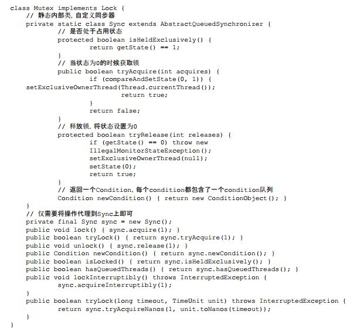
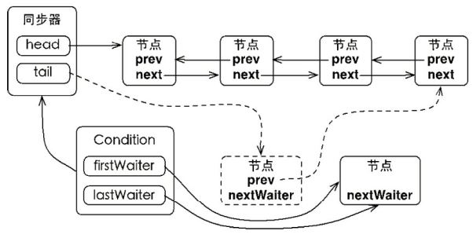

# **关于AbstractQueuedSynchronizer** 
***
## 简介
* aqs是构建锁的基础框架,在其中使用了一个int变量来表示获取锁的状态,并通过其内部的FIFO双向链表来对获取锁的线程排队.
* 我们可以通过继承AbstractQueuedSynchronizer并重写其抽象方法来管理其同步状态.AQS支持独占式的锁,也支持共享式的锁.比如ReentrantLock或Semaphore都是AQS独占或共享式的实现.

## 接口
* 同步器基于模板方法模式,使用者需要继承并重写指定方法,在使用时调用同步器的模板方法会调用调用使用者重写的方法. 

		protected boolean tryAcquire(int arg)  独占式获取锁
		protected boolean tryRelease(int arg)	独占式释放锁
		protected int tryAcquireShared(int arg)	共享式获取锁
		protected boolean tryReleaseShared(int arg)	共享式释放锁
		protected boolean isHeldExclusively()  查看独占锁是否被当前线程占用getExclusiveOwnerThread() == Thread.currentThread()或查看独占锁是否被占用
* 一个基于AQS的非重入独占锁   

## 结构定义
1. AQS中FIFO的双向队列 
	* AQS依赖其内部的双向队列来管理获取锁的线程,当一个线程去获取锁时,若获取失败,则AQS会将当前线程构造为一个Node加入队列的队尾,同时阻塞(LockSupport.pack)该线程,当锁被首节点(首节点为获取锁的节点)释放,会唤醒下一个节点(LockSupport.unpark),让其再次尝试获取锁.(注意使用LockSupport阻塞而不是基于锁的),获取锁后会将自己设为首节点并将前首节点移除队列(包括对前首节点后继节点指针的移除);
	* AQS维护队列的首和尾;
	* 由于对AQS获取锁时并发的访问(所有线程都可以来获取锁),为保证入队串行化,AQS使用CAS来更新尾节点.
	* 队列定义代码如下:
		
			队头:
			/**
		     * Head of the wait queue, lazily initialized.  Except for
		     * initialization, it is modified only via method setHead.  Note:
		     * If head exists, its waitStatus is guaranteed not to be
		     * CANCELLED.
		     */
		    private transient volatile Node head;
			
			队尾:
			/**
		     * Tail of the wait queue, lazily initialized.  Modified only via
		     * method enq to add new wait node.
		     */
		    private transient volatile Node tail;
			

			AQS的同步状态:
			 /**
		     * The synchronization state.
		     */
		    private volatile int state;
	* 
2. AQS中Node节点
	* Node是AQS的内部类,其实例是AQS对列中的元素,AQS维护这个队列的Head和Tail的指针,没有获取到锁的线程会被构造为一个Node推入队尾,每个Node维护其前驱及后继节点,故AQS的同步队列为一个双向队列;
	* Node定义代码如下:

			
	        /** 标记表示一个节点是在共享模式 */
	        static final Node SHARED = new Node();
	        /** 标记表示一个节点是在独占模式 */
	        static final Node EXCLUSIVE = null;
	
	        /** waitStatus 的值为1表示节点线程被取消*/
	        static final int CANCELLED =  1;
	        /** waitStatus 的值为-1表示后继节点线程处于等待唤醒 */
	        static final int SIGNAL    = -1;
	        /** waitStatus 的值为-2表示节点线程处于等待对列中,节点等待在Condition上 */
	        static final int CONDITION = -2;
	        /**
	         * waitStatus 的值为-3表示共享同步状态应被无条件传播到其他节点
	         */
	        static final int PROPAGATE = -3;
	
	        /**
	         * waitStatus为以下枚举:
	         *   SIGNAL:     该节点的后继节点 (或即将)被阻塞
	         *               (通过LockSupport.pack()), 故当前节点在释放或取消时必须唤醒(unpark())
	         *               它的后继节点. 为了避免竞争, acquire方法需要先指明他需要一个信号,
	         *              然后去原子的获取锁,如果失败则阻塞;
	         *   CANCELLED:  该节点因超时或被打断而取消.节点进入这个状态则不会在改变,特别要指出
	         *               该节点不会再被阻塞;
	         *   CONDITION:  这个节点目前在condition 队列上.
	         *               直到被转为同步队列的一分子前,它不会作为同步队列的一员, 
	         *               在那时,状态会被设为0. 
	         *   PROPAGATE:  A releaseShared should be propagated to other
	         *               nodes. This is set (for head node only) in
	         *               doReleaseShared to ensure propagation
	         *               continues, even if other operations have
	         *               since intervened.
	         *   0:          以上都不是
	         *
	         * 这些枚举从小到大排列是为了简单易用.
	         * 非负节点表示该节点不需要被唤醒
	         * 所以大部分的值不用检查特别情况,直接唤醒.
	         *
	         * 该值初始化为0表示普通的同步节点,CONDITION 为等待队列节点.
	         *   使用CAS更新
	         */
	        volatile int waitStatus;
	
	        /**前节点
	         * Link to predecessor node that current node/thread relies on
	         * for checking waitStatus. Assigned during enqueuing, and nulled
	         * out (for sake of GC) only upon dequeuing.  Also, upon
	         * cancellation of a predecessor, we short-circuit while
	         * finding a non-cancelled one, which will always exist
	         * because the head node is never cancelled: A node becomes
	         * head only as a result of successful acquire. A
	         * cancelled thread never succeeds in acquiring, and a thread only
	         * cancels itself, not any other node.
	         */
	        volatile Node prev;
	
	        /**后节点
	         * Link to the successor node that the current node/thread
	         * unparks upon release. Assigned during enqueuing, adjusted
	         * when bypassing cancelled predecessors, and nulled out (for
	         * sake of GC) when dequeued.  The enq operation does not
	         * assign next field of a predecessor until after attachment,
	         * so seeing a null next field does not necessarily mean that
	         * node is at end of queue. However, if a next field appears
	         * to be null, we can scan prev's from the tail to
	         * double-check.  The next field of cancelled nodes is set to
	         * point to the node itself instead of null, to make life
	         * easier for isOnSyncQueue.
	         */
	        volatile Node next;
	
	        /**节点的线程
	         * The thread that enqueued this node.  Initialized on
	         * construction and nulled out after use.
	         */
	        volatile Thread thread;
	
	        /**独占模式等待队列中的后节点/若为共享的则为SHARED
	         * Link to next node waiting on condition, or the special
	         * value SHARED.  Because condition queues are accessed only
	         * when holding in exclusive mode, we just need a simple
	         * linked queue to hold nodes while they are waiting on
	         * conditions. They are then transferred to the queue to
	         * re-acquire. And because conditions can only be exclusive,
	         * we save a field by using special value to indicate shared
	         * mode.
	         */
	        Node nextWaiter;
	
	        /**
	         * Returns true if node is waiting in shared mode.
	         */
	        final boolean isShared() {
	            return nextWaiter == SHARED;
	        }
	
	        /**
	         * Returns previous node, or throws NullPointerException if null.
	         * Use when predecessor cannot be null.  The null check could
	         * be elided, but is present to help the VM.
	         *
	         * @return the predecessor of this node
	         */
	        final Node predecessor() throws NullPointerException {
	            Node p = prev;
	            if (p == null)
	                throw new NullPointerException();
	            else
	                return p;
	        }
	
	        Node() {    // Used to establish initial head or SHARED marker
	        }
	
	        Node(Thread thread, Node mode) {     // Used by addWaiter
	            this.nextWaiter = mode;
	            this.thread = thread;
	        }
	
	        Node(Thread thread, int waitStatus) { // Used by Condition
	            this.waitStatus = waitStatus;
	            this.thread = thread;
	        }

3. AQS中Condition与等待队列
	* 在AQS中Condition接口的实现类为ConditionObject;
	* 等待队列是基于锁的,注意该线程必须先获取锁,在使用Condition.await来等待,同时该线程会释放锁,构造为Node加入等待队列;
	* 等待队列是一个FIFO的队列,每个的等待的线程被构造为一个Node,每个ConditionObject包含一个等待队列;
	* ConditionObject对象拥有首尾节点指针firstWaiter和lastWaiter,新加入一个Node只用将元尾节点的next指向新节点,并更新lastWaiter即可;节点入队的过程没有使用CAS来保障因为入队的节点必定获取了锁,所以是线程安全的.
	* 
	* 从同步队列到等待队列:由于在获取锁的线程使用Condition.await时,会进入等待队列并释放锁.从同步队列和等待队列来看就等于同步队列的首节点(同步队列首节点获取锁)移动到了等待队列尾部,然后释放锁同时唤醒同步队列的后继节点,进入等待队列的节点状态会置为CONDITION,并LockSupport.park(this)阻塞,等待状态会直到Condition.signal或被打断.
	* 从等待队列到同步队列:当等待队列中的节点被唤醒(Condition.signal),则这个节点开始获取锁,如果对等待队列中的线程进行中断,会抛出打断异常.Condition.signal会唤醒等待队列中的等待时间最长的处于没有被取消状态的非空节点(首节点),在唤醒节点(LockSupport.unpark)之前,使用CAS将该节点的waitStatus由CONDITION更新到0,然后会将这个节点移到同步队列,同时将前节点waitSattus改为SIGNAL,若其前节点取消或更改失败则LockSupport.unpark唤醒入队节点.
	* 
	* 

## 代码分析
* 获取锁:tryAcquire为使用者重写的获取锁的方法,在该方法中获取锁,修改AQS的state状态(通过getState(),compareAndSetState(int, int)等修改),成功则返回,失败则进入同步队列;

		public final void acquire(int arg) {
        if (!tryAcquire(arg) &&
            acquireQueued(addWaiter(Node.EXCLUSIVE), arg))
            selfInterrupt();
    }
* 进入同步队列
		
		1.将当前线程包装为node
		private Node addWaiter(Node mode) {
	        Node node = new Node(Thread.currentThread(), mode);
	        // Try the fast path of enq; backup to full enq on failure
	        Node pred = tail;
	        if (pred != null) {
	            node.prev = pred;
	            if (compareAndSetTail(pred, node)) {
	                pred.next = node;
	                return node;
	            }
	        }
	        enq(node);
	        return node;
   	 	}
	
		2.初始化队列首尾节点,并将node入队
		 private Node enq(final Node node) {
	        for (;;) {
	            Node t = tail;
	            if (t == null) { // Must initialize
	                if (compareAndSetHead(new Node()))
	                    tail = head;
	            } else {
	                node.prev = t;
	                if (compareAndSetTail(t, node)) {
	                    t.next = node;
	                    return t;
	                }
	            }
	        }
	    }
		
		3.入队后若前节点是Head则去获取锁,获取失败就block(LockSupport.park)掉,获取成功则将自己设为头并且将前节点移除队列
		final boolean acquireQueued(final Node node, int arg) {
	        boolean failed = true;
	        try {
	            boolean interrupted = false;
	            for (;;) {
	                final Node p = node.predecessor();
	                if (p == head && tryAcquire(arg)) {
	                    setHead(node);
	                    p.next = null; // help GC
	                    failed = false;
	                    return interrupted;
	                }
	                if (shouldParkAfterFailedAcquire(p, node) &&
	                    parkAndCheckInterrupt())
	                    interrupted = true;
	            }
	        } finally {
	            if (failed)
	                cancelAcquire(node);
	        }
	    }
* 释放锁:tryRelease为使用者重写的方法,若释放成功,则会唤醒同步队列中block掉的后继节点(LockSupport.unpark);
		
		1.尝试释放锁
		 public final boolean release(int arg) {
	        if (tryRelease(arg)) {
	            Node h = head;
	            if (h != null && h.waitStatus != 0)
	                unparkSuccessor(h);
	            return true;
	        }
	        return false;
	    }
		
		2.成功则唤醒同步队列中block掉的后继节点
		private void unparkSuccessor(Node node) {
        /*
         * If status is negative (i.e., possibly needing signal) try
         * to clear in anticipation of signalling.  It is OK if this
         * fails or if status is changed by waiting thread.
         */
        int ws = node.waitStatus;
        if (ws < 0)
            compareAndSetWaitStatus(node, ws, 0);

        /*
         * Thread to unpark is held in successor, which is normally
         * just the next node.  But if cancelled or apparently null,
         * traverse backwards from tail to find the actual
         * non-cancelled successor.
         */
        Node s = node.next;
        if (s == null || s.waitStatus > 0) {
            s = null;
            for (Node t = tail; t != null && t != node; t = t.prev)
                if (t.waitStatus <= 0)
                    s = t;
        }
        if (s != null)
            LockSupport.unpark(s.thread);
    }
 
* 进入等待队列:注意进入等待队列通过AQS的实现类中生产new ConditionObject(),在调用线程获取锁后才可以在condition的等待队列上等待.
		
		1.持有锁的线程在condition上等待
		 public final void await() throws InterruptedException {
            if (Thread.interrupted())
                throw new InterruptedException();
            Node node = addConditionWaiter();
            int savedState = fullyRelease(node);
            int interruptMode = 0;
            while (!isOnSyncQueue(node)) {
                LockSupport.park(this);
                if ((interruptMode = checkInterruptWhileWaiting(node)) != 0)
                    break;
            }
            if (acquireQueued(node, savedState) && interruptMode != THROW_IE)
                interruptMode = REINTERRUPT;
            if (node.nextWaiter != null) // clean up if cancelled
                unlinkCancelledWaiters();
            if (interruptMode != 0)
                reportInterruptAfterWait(interruptMode);
        }

		2.将这个线程加入等待队列队尾,不需要CAS因为获取了锁
		private Node addConditionWaiter() {
            Node t = lastWaiter;
            // If lastWaiter is cancelled, clean out.
            if (t != null && t.waitStatus != Node.CONDITION) {
                unlinkCancelledWaiters();
                t = lastWaiter;
            }
            Node node = new Node(Thread.currentThread(), Node.CONDITION);
            if (t == null)
                firstWaiter = node;
            else
                t.nextWaiter = node;
            lastWaiter = node;
            return node;
        }

		3.释放锁,并唤醒同步队列后继节点(LockSupport.unpark),后继节点会将该节点T出同步队列
		 final int fullyRelease(Node node) {
	        boolean failed = true;
	        try {
	            int savedState = getState();
	            if (release(savedState)) {
	                failed = false;
	                return savedState;
	            } else {
	                throw new IllegalMonitorStateException();
	            }
	        } finally {
	            if (failed)
	                node.waitStatus = Node.CANCELLED;
	        }
	    }

		4.被Block至signal或interrupt,注意被唤醒后会检查是否被calcelled或interrupted,calcell出队,interrupt抛异常
		while (!isOnSyncQueue(node)) {
                LockSupport.park(this);
                if ((interruptMode = checkInterruptWhileWaiting(node)) != 0)
                    break;
            }
* 等待队列唤醒:
		
		1.唤醒队首,若没有持有锁会跑异常
		public final void signal() {
            if (!isHeldExclusively())
                throw new IllegalMonitorStateException();
            Node first = firstWaiter;
            if (first != null)
                doSignal(first);
        }

		2.移除一个等待队列队首节点
		 private void doSignal(Node first) {
            do {
                if ( (firstWaiter = first.nextWaiter) == null)
                    lastWaiter = null;
                first.nextWaiter = null;
            } while (!transferForSignal(first) &&
                     (first = firstWaiter) != null);
        }

		3.保证移除的首节点不是calcelled节点,若不是calcelled节点,则将其加入同步队列,并修改同步队列前一节点的waitStatus
		final boolean transferForSignal(Node node) {
	        /*
	         * If cannot change waitStatus, the node has been cancelled.
	         */
	        if (!compareAndSetWaitStatus(node, Node.CONDITION, 0))
	            return false;
	
	        /*
	         * Splice onto queue and try to set waitStatus of predecessor to
	         * indicate that thread is (probably) waiting. If cancelled or
	         * attempt to set waitStatus fails, wake up to resync (in which
	         * case the waitStatus can be transiently and harmlessly wrong).
	         */
	        Node p = enq(node);
	        int ws = p.waitStatus;
	        if (ws > 0 || !compareAndSetWaitStatus(p, ws, Node.SIGNAL))
	            LockSupport.unpark(node.thread);
	        return true;
	    }